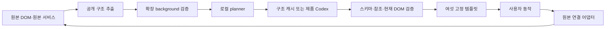

# FLECTO 구현 착수 계획

작성일: 2026-09-29, Asia/Seoul. 대상: Project_FLECTO_Master_Pack_v7.
상태: 원본 82개 문서 전체 검토 및 실행 계획 수립 완료. 제품 구현·제품 검사 결과를 뜻하지 않는다.

## 1. 이번 요청과 현재 확인 결과

사용자는 패키지를 먼저 모두 읽고 구현 방법을 정리하도록 요청했다. 개발은 Astra 6 Ultra, UI/UX는 Claude Opus 5.5 서브에이전트로 나눈다. 문서에 포함된 예시 승인문이나 과거 실행 지시는 현재 사용자 요청과 구분한다.

- 빈 프로젝트 폴더에 ZIP의 82개 Markdown 파일을 추출했다. 현재 문서 69개, 과거 자료 13개다.
- 추출 직후 82개 파일이 ZIP과 바이트 단위로 일치했다. FILE_MANIFEST.md의 81개 해시와 크기도 모두 일치했다.
- 작업 경로: 저장소 루트. 팀원은 각자 clone한 경로를 사용한다.
- macOS 26.5.1 arm64, Node 25.8.1, npm 11.11.0, Git 2.55.0을 확인했다.
- Codex CLI 0.147.0, OpenCodex 2.70.0을 확인했다. OpenCodex health는 `ok: true`다.
- Google Chrome 154.0.8037.58 앱이 설치되어 있다. 제품용 프로필·확장 실행은 아직 확인하지 않았다.
- 최초 계획 점검 시 Git 저장소, package.json, 제품 코드, 프로젝트 의존성은 없었다. 이후 협업 초기 설정으로 Git·root package/lock·문서 CI를 추가했으며 제품 코드는 아직 없다. 현재 설정은 [저장소 설정 기록](state/REPOSITORY_SETUP.md)을 따른다.
- 제품 Codex 런타임의 인증·모델·JSON 출력·취소·도구 제한은 별도 P01 시험 대상이다. 개발 모델 연결과 혼동하지 않는다.
- 현재 문서의 정적 검사 26/26은 패키지 작성자가 남긴 보고다. 이번에는 ZIP 무결성·바이트·해시 검사를 추가 수행했다. 제품 T01–T40, 운영 OPER01–OPER15는 NOT_RUN이다.

## 2. 구현할 제품과 첫 통과 기준

제품은 Chrome MV3 확장과 로컬 planner 서버다. 원본 사이트 위에 큰 글씨와 큰 버튼의 단계형 화면을 표시한다. 원본 DOM과 세션은 유지한다.

첫 통과 기준은 아래 한 흐름이다.

`FLECTO 입력 → 원본 input/change handler → 원본 검증 → 사용자 최종 클릭 → 원본 submit handler → 원본 DB 저장 → 원본 접수 정보 확인`

처음에는 명시적인 fixture 계획으로 연결을 확인한다. 별도 Codex 제품 연결이 준비되면 동일 경로에 실제 계획 출력을 넣는다. 실제 AI 호출 실패를 fixture로 자동 교체하지 않는다.

첫 사이트는 가상 구매 혜택 신청이다. 구조 변형을 통과한 뒤 React SPA 문화센터로 확장한다. 두 사이트가 공통으로 사용하는 것은 템플릿과 연결 엔진이며, 사이트별 정답 계획이나 원본 신청 API를 제품에 심지 않는다.

현장용 전달물은 빌드한 확장 폴더, 로컬 실행·초기화 도구, 설치·시연 안내, 검증 근거다. 별도 네이티브 앱 설치기나 스토어 등록은 이번 문서의 구현 선행조건으로 추가하지 않는다.

## 3. 모델과 작업 소유권

| 담당 | 요청 모델 | 구현 책임 | 쓰기 경계 |
|---|---|---|---|
| 리드·통합 | `gpt-6-astra`, `ultra` | 공통 계약, 빌드 설정, 작업 배정, 최종 통합·수용 판단 | root 설정, `packages/contracts`, 통합 controller |
| 코어 작업자 | `gpt-6-astra`, `ultra` | extractor/binder/verifier, 메시지, 원본 서비스, planner/cache/deadline | 티켓별 서로 겹치지 않는 경로 |
| UI/UX 작업자 | `anthropic/claude-opus-5-5` | 토큰, 여섯 템플릿, shell, 오류·로딩·원본 복귀 표현, 시각 QA | `packages/design-tokens`, `packages/templates`, `apps/extension/src/ui` |
| 독립 QA·검토 | `gpt-6-astra`, `ultra` | 원본 저장 oracle, 구조 변형, 실패·취소·유출·회귀 검증 | 별도 테스트 경로와 근거 문서 |

이번 문서 검토에는 Claude Opus 5.5 요청 작업과 Astra 6 Ultra 요청 작업을 실제 생성했다. Astra 검토는 결과를 반환했다. Claude 장문 검토는 결과를 받지 못한 채 리드가 중단했고, 해당 문서 전부를 리드가 이어 읽었다. 이후 같은 `anthropic/claude-opus-5-5` 요청 모델의 짧은 low-effort 시험에서 `FLECTO_UI_READY`를 실제 수신했다. 이는 지정 경로의 응답 확인이며 장문 검토·UI 구현 완료를 의미하지 않는다. UI/UX 구현은 Opus 5.5로 유지하고 짧은 티켓부터 배정한다. 공급자 내부 실제 모델 보고는 별도 미확인이다.

공통 계약과 의존성 설치는 한 작성자가 담당한다. 제품 구현 작업자는 처음 2개 슬롯으로 시작하고, 통합이 안정되면 최대 4개를 기본으로 한다. 무거운 설치·빌드·E2E는 한 번에 하나만 실행한다. read-only 문서 검토의 병렬 수와 제품 작성자 수는 구분한다.

Git 기준점이 생긴 뒤 쓰기 작업은 격리된 checkout과 경로 소유권을 갖는다. 격리를 확인하지 못하면 쓰기는 순차 진행한다. 병합과 package lock 갱신은 리드 한 명이 한다.

## 4. 모듈과 데이터 흐름

문서의 TypeScript 단일 모노레포, React/Vite, Fastify, SQLite, Vitest/Playwright 구성을 유지한다. 각 패키지 버전은 설치 시 실제 지원 조합을 확인하고 하나의 lockfile에 고정한다.

```text
apps/
  extension/      MV3 background, content controller, UI, options
  planner/        provider, cache, deadline, metrics, 제한된 loopback HTTP
  demo-benefits/  로그인·full navigation·원본 검증·접수 DB
  demo-culture/   React controlled input·SPA·정원·예약 DB
packages/
  contracts/      TS 타입 + runtime schema의 단일 원천
  core/           extractor, binder, verifier, fingerprint
  templates/      여섯 공통 화면
  design-tokens/  글씨·색상·간격·포커스·동작 감소
tests/
  unit/ integration/ e2e-fixture/ e2e-live/ holdout/ ops/
scripts/          doctor, 검사, 시연, 패키징
```



개인 입력값·선택·접수 결과는 브라우저 내부에 둔다. 모델에 전달하는 payload는 별도 serializer가 공개 allowlist 필드만 생성한다. UI 전체 상태나 DOM 전체를 JSON으로 보내는 경로를 만들지 않는다.

## 5. C01에서 먼저 고정할 계약

기존 여섯 계약을 유지한다: `PublicPageSnapshot`, `PrivateBindingRegistry`, `PagePlan`, `CachedBlueprint`, `ActionReceipt`, `RunMetric`.

추가로 UI와 코어 사이의 로컬 계약을 명시한다. 이는 새 제품 기능이 아니라 기존 요구사항을 구현 가능한 경계로 만드는 결정이다.

| 로컬 계약 | 코어가 제공할 것 | UI가 돌려줄 것 |
|---|---|---|
| 읽기 모델 | 검증된 제목·원문·필수 여부·현재 선택지·실제 값·오류·허용 행동 | 없음 |
| 동작 | 실행 가능한 ref와 단계 | `LOCAL_NEXT/BACK`, `SET_TEXT`, `SET_CHOICE`, 사용자 동의, `INVOKE_SOURCE` |
| 입력 동기화 | 반영 상태·원본 재읽기 결과·충돌·private revision | 초안 변경·composition 시작/종료·수정 의도 |
| 제출 확인 | 실제 값과 document/semantic/value revision에 연결된 확인 상태 | 명확한 최종 제출 의도 |
| 복귀 | 원본 반영 완료 값과 미반영 초안의 구분·복귀 가능 상태 | 원본 보기·종료·취소 의도 |

UI는 DOM을 직접 검색하거나 원본 버튼을 직접 누르지 않는다. API 요청·타이머·제출 lock·성공 판단은 controller에 둔다. `LOCAL_NEXT`가 원본 submit을 실행할 수 없도록 타입과 실행기를 함께 나눈다.

`PagePlan`은 template enum, snapshot/element/notice ref와 원본 행동 ref만 가진다. 실행 코드·임의 selector·외부 URL은 허용하지 않는다. 필수 항목 누락, 다른 form, 중복/모호한 ref, 오래된 document는 거절한다.

UI 상태는 초안으로 `IDLE → PREPARING → READY → REVIEW → SUBMITTING → SUCCESS / SOURCE_REJECTED / OUTCOME_UNKNOWN`를 둔다. `CANCELLED`, `TIMED_OUT`, `AUTH_REQUIRED`, `STALE_DOCUMENT`는 별도 복구 전이를 가진다. 최종 discriminated union과 전이표는 C01에서 잠근다.

## 6. 단계별 실행 순서

| 단계 | 대응 티켓 | 만드는 것 | 넘어가는 조건 |
|---|---|---|---|
| 0. 준비와 계약 | E00/E01/E02/C01/Q01 | 실행 환경, 버전, 타입/schema, 테스트 등록, 빌드 뼈대 | 타입·schema 거절 검사, 최소 확장 빌드, 테스트 누락 감지 |
| 1. 첫 원본 연결 | D01/X01/V01/U01/N01/PF01/B01/I00/G00 | 원본 서비스, 입력 어댑터, 최소 UI, fixture provider | 실제 원본 handler와 DB 저장, 틀린 ref 차단 |
| 2. 첫 사이트 전체 흐름 | U02/N02/L01/R01/G01 | 첫 화면→신청→동의→검토→접수, 오류·복귀·10초 종료 | 정상·잘못된 주문·동의 누락·중복 클릭·이동·timeout 확인 |
| 3. 구조 변화와 재사용 | K01/Q02/I02/G02 | blueprint, 재연결, 독립 구조 변형 | 무해한 변경은 정상 완료, 중요 변경은 무효화·재분석 |
| 4. 두 번째 사이트 | D02/B02/I03/G03 | 문화센터, React 입력, 최신 정원·선택지 | 문화센터 실제 저장 + 구매 혜택 회귀 |
| 5. 실제 모델·시각 보완·품질 | P01/A01/M01/VIS01/UX01/SEC01/DEMO01, 조건부 PERF01 | 실제 AI 흐름, 안전한 시각 보완, UI QA, 후원 카드, 실측 | 전체 기능 통합 후보 또는 누락 기능이 명확한 제한 후보 |
| 6. 전체 검사·출고 | G4/LIVE01/DOC01/REL01 | T01–T40, 동일 빌드 LIVE, 원본 저장 근거, 발표·패키지 | 현행 등급 정의대로 수용하고 한계 표시 |

P01 제품 Codex probe는 PF01이 생기는 즉시 병행한다. 5단계까지 인증·호환성 확인을 미루는 뜻이 아니다. D02 원본 서비스도 계약 이후 독립 준비할 수 있지만, 첫 사이트 구조 변형의 완료를 기다리게 만들지 않는다.

FULL_LIVE 경로는 `VIS01 구현·통합 → G4(T01–T40 전체 요구 assertion) → LIVE01 → REL01`이다. 시각 보완이 미지원·미승인·미완료이면 안전한 거부 경로만 확인하고 positive assertion은 NOT_RUN으로 남긴다. 이 경우 전체 통과로 승격하지 않고, DOM LIVE와 안전 검증 범위에 따라 LIMITED_LIVE 이하의 출고 분기로 정리한다. 코드가 변경되면 같은 artifact의 관련 검사를 다시 실행한다.

G0에서 사용할 최소 UI는 U01 범위에 포함한다. G0를 기다리는 U02 전체 shell이 최초 연결에 필요해지는 순환 의존성을 만들지 않는다.

처음 배정할 구체 작업은 다음과 같다.

1. 리드: 루트 설정, contracts v1, typed stubs, 테스트 등록 방식을 완성한다.
2. Astra 작업자: 구매 혜택 원본 서비스를 먼저 만들고 원본만으로 신청·저장을 확인한다.
3. Claude 작업자: 확정된 로컬 ViewModel/action 계약으로 토큰과 여섯 템플릿을 만든다.
4. 리드: extractor/verifier/binder와 메시지·fixture를 연결해 G0를 통합한다.
5. 다음 슬롯: 독립 QA 또는 provider probe를 배정하며 첫 통합 결과를 확인한다.

## 7. 구현 중 먼저 해결할 위험

### 원본 입력과 제출

native input, checkbox, radio/select의 변경 경로를 구분한다. 원본 handler를 거친 뒤 다음 render와 원본 값을 다시 읽는다. React private state를 직접 수정하거나 DOM value만 바뀐 것을 성공으로 처리하지 않는다. 한국어 composition 중 Enter·검증·포커스 이동·재배치가 발생하지 않게 한다.

제출 직전에 대상·form·disabled·document·semanticRevision·privateValueRevision을 재확인한다. 제출 요청은 즉시 잠그며, 응답이 유실되면 `OUTCOME_UNKNOWN`을 보여주고 자동 재제출하지 않는다.

### 이동과 확장 생명주기

full navigation은 원본 refs를 폐기하고 새 문서를 다시 연결한다. SPA 변경과 BFCache 복귀도 따로 처리한다. 활성 탭의 동작 소유권과 비개인 pending 정보를 session 저장소에 두고 service worker 전역 변수만 믿지 않는다. 재시작 후 미완료 제출을 다시 click하지 않는다.

Chrome의 activeTab 권한은 사용자 동작으로 얻고 다른 origin으로 이동하면 해제된다. 두 원본 사이트는 각자 활성화한다. [Chrome activeTab](https://developer.chrome.com/docs/extensions/develop/concepts/activeTab)

MV3 worker는 유휴 상태에서 종료될 수 있고 전역 변수도 사라지므로 복구 시험을 포함한다. [Chrome worker lifecycle](https://developer.chrome.com/docs/extensions/develop/concepts/service-workers/lifecycle)

### 요청 시간과 광고

사용자의 한 준비 요청 전체에 10초 budget을 둔다. queue·구조 추출·모델·검증·시각 보완을 포함한다. 내부 재시도나 페이지 변화로 남은 시간을 몰래 초기화하지 않는다. 명시적 재시도만 새 요청이다.

3초는 controlsReady 목표다. 3초를 넘기고 아직 준비 중인 경우에만 정적 후원 카드를 보여준다. READY가 광고보다 우선하며, 취소·10초 만료 때 광고를 종료한다. 후원 카드에는 `시연용 광고 · 실제 후원 계약 없음`을 표시한다.

### 제품 Codex 경로

TypeScript Codex SDK의 서버 측 연결을 기본 후보로 유지한다. 공식 문서는 애플리케이션에서 로컬 Codex thread를 제어하는 인터페이스를 제공한다. [Codex SDK](https://learn.chatgpt.com/docs/codex-sdk)

설치할 정확한 SDK/CLI 버전에서 schema 출력·취소·모델 응답·도구 제한을 시험해야 한다. 개발용 HOME·MCP·repo 설정을 제품 추론에 통째로 물려주지 않는다. 현재 로그인·프록시 정상 응답만으로 제품 환경 격리나 LIVE를 확인했다고 기록하지 않는다.

개발 모델의 Astra Ultra 설정을 제품 모델에 자동 적용하지 않는다. 제품은 별도 합성 8사례에서 정확도와 지연을 확인한 뒤 후보와 설정을 잠근다. SDK 시험이 막혀도 fixture를 통한 원본 연결은 계속할 수 있다.

### 개인정보와 원본 결과

합성 원본 사이트에서도 private 입력·개인 결과·인증정보가 public snapshot, cache, metric, 광고로 넘어가지 않는지 sentinel을 넣어 확인한다. QA oracle의 token과 DB 권한은 제품에 제공하지 않는다.

제품의 성공 화면은 원본에서 관찰한 처리 근거로 결정한다. QA는 원본 DB의 값과 건수를 독립 확인한다. 단순히 `완료`라는 글자나 DOM 반영 receipt만으로 성공을 만들지 않는다.

## 8. UI/UX 제작 기준

현재 기준은 밝은 배경, 짙은 글씨, 파란 주요 버튼이다. 본문 26px, 22/26/30px 선택, 버튼 높이 56px 이상, 읽기 폭 약 760px를 출발값으로 둔다.

여섯 템플릿은 작업 선택, 입력 묶음, 항목 선택, 안내·동의, 최종 확인, 결과다. 관련 입력 2~3개를 묶고 원문 보기·원본 복귀를 유지한다. 기술 상태는 일반 조작 화면을 압도하지 않게 접힌 시연 정보에 둔다.

Claude의 납품물은 토큰과 실제 React 컴포넌트, 상태별 예시, 오류·focus·zoom 근거다. 화면 이미지만으로 완료 처리하지 않는다. live DOM 값으로 재확인하고 연결하는 책임은 Astra 코어에 둔다.

확인할 상태: 빈 화면, 준비 중, 후원 카드, 오류, 원문, 검토·수정, 제출 중, 성공, 원본 거절, 결과 확인 필요, timeout, 200% 확대, 짧은 viewport, 긴 한국어, 원본 복귀.

화면별 완료 조건은 다음처럼 정한다.

| 화면 | 주요 행동 | UI가 지켜야 할 동작 |
|---|---|---|
| 작업 선택 | 현재 원본에서 발견한 작업 선택 | 2~4개 우선 표시, 추가 작업 펼침, 다른 일 입력, 확인되지 않은 작업의 정직한 안내 |
| 입력 묶음 | 관련 입력 2~3개 입력 | 실제 label/도움말/원문, 오류 위치 안내, composition과 초안 보존 |
| 항목 선택 | 강좌·시간 등 명시적 선택 | 기본값을 임의 확정하지 않음, 선택을 색과 문구로 함께 표현, 최신 정원·옵션 반영 |
| 안내·동의 | 원문 확인 후 필수/선택 동의 | 사용자 행동 없이 체크 변경 금지, 모두 동의 임의 추가 금지, 중요한 고지 보존 |
| 최종 확인 | 실제 값 검토·수정·명확한 제출 | 값 수정 시 다른 초안 보존, 조건 변경 시 재확인, `혜택 신청하기` 등 구체 행동명 |
| 결과 | 원본 내역 확인·종료 | 성공/원본 거절/결과 확인 필요 분리, 근거 없는 축하나 자동 재제출 없음 |

첫 UI 티켓은 토큰·기본 제어·입력 묶음과 검토 화면으로 작게 나누되, U01의 최종 범위는 여섯 템플릿 전체다. UI 개발용 예시는 합성 상태로 구성하고 제품 LIVE와 혼동하지 않게 표시한다. 접근성 토큰, 화면 구조, 상태별 컴포넌트, 실제 통합 QA 순서로 진행한다.

원본 보기와 종료는 구분한다. 코어가 실제 반영값과 미반영 초안을 알려주며, UI는 원본 복귀 시 이를 설명하고 원래 focus를 복구한다. 제출 중에는 다시 신청하기를 노출하지 않으며 원본 내역 확인 경로를 우선한다. 준비 취소의 10초 상한을 원본 신청 서버의 처리 완료 보장으로 오해하지 않게 문구를 구분한다.

## 9. 검증·출고·발표

단위 검사는 schema·전이·시간·동작 분리에, 통합 검사는 extractor→binder→원본 handler와 데이터 경계에 집중한다. 실제 원본 두 개와 확장을 실행하는 E2E가 최종 근거다.

자동 확장 검사는 Playwright 번들 Chromium의 별도 persistent context에서 진행한다. 공식 Playwright 문서는 Chrome/Edge의 확장 sideload용 CLI flag 변경 때문에 번들 Chromium 사용을 안내한다. 실제 설치 Chrome의 비밀번호 자동완성·한글 IME는 별도 수동 확인으로 남긴다. [Playwright extension testing](https://playwright.dev/docs/chrome-extensions)

제품 T01–T40과 운영 OPER01–OPER15를 섞지 않는다. skip·빈 테스트·실행하지 않은 수동 검사를 PASS로 채우지 않는다. cold LIVE와 warm cache를 분리하고, 두 사이트의 같은 release candidate에서 원본 저장과 호출 근거를 연결한다.

독립 검토에서 확인한 보완 사항은 C01/Q01에 반영한다.

- `tests/manifest.json`에서 요구 ID, assertion ID, 적용 site/mode, positive/negative 경로, 필요한 gate를 각각 명시한다. 결과가 없는 항목은 NOT_RUN이다.
- FULL_LIVE는 T01–T40 전체 요구 assertion과 두 사이트별 cold LIVE 3회 이상, 원본 결과 대조를 요구한다. T34의 실제 시각 보완 positive 경로도 포함하므로, 이를 구현·검증하지 못하면 FULL_LIVE로 표시하지 않는다.
- LIMITED_LIVE는 두 사이트의 DOM 기반 LIVE와 공통 안전 조건을 확인한 상태이며, 누락 assertion과 capability를 공개한다. SINGLE_SITE_LIVE는 구매 혜택의 실제 흐름과 해당 안전 gate가 필요하다. 각 등급의 정확한 기계 판정 집합은 테스트 구현 전에 원문을 보존한 별도 manifest로 잠근다.
- 모호한 `CODE_FULL`, `FULL`, `SINGLE` 축약 대신 정식 `product_grade`와 `manual_status`, `demo_ready`를 쓴다. 이 명칭 정리는 제품 요구조건을 줄이지 않는다.
- 근거 manifest에는 source SHA, 확장/서버 artifact hash, schema/contract/gate/prompt/cache/model/run-settings 버전, site, cold/warm 조건, 실제 요청·성공·실패 수, 원본 oracle 참조, MANUAL01–03, capability 상태를 연결한다.
- `demo_ready`는 자동 검사 등급만으로 true가 되지 않는다. 시연 Chrome 저장 테스트 계정, 실제 Mac 한글 입력기, 확대·설정·포커스 확인이 필요하다.

보관 자료와 대조한 결과, T01–T26 조건과 통과 문구가 유지되어 있다. v5의 고정 개발 모델·초기 작업자 4개·첫 연결의 제품 인증/감독자 의존·26개만으로 전체 완료를 정하는 기준은 이번 실행으로 가져오지 않는다.

MANAGED_LOOP는 실제 복구 시험을 통과했을 때만 주장한다. 초기 구현은 네이티브 서브작업과 세션 체크포인트를 사용한다. 별도 감독 플랫폼의 완성을 첫 제품 연결의 선행조건으로 삼지 않는다.

발표는 첫 정상 빌드 이후 같은 빌드에서 확보한 네 가지 증거를 우선한다: 실제 접수 저장, 준비 후 계획 경로를 차단해도 현재 화면 조작, 구조 변화 시 재검증, 두 사이트의 공통 UI.

발표·홍보 문서를 전부 검토한 결과, COM 작업은 제품 DAG와 독립적으로 문구·빈 도형까지 준비할 수 있다. 실제 캡처와 실측은 검증 빌드 이후에 넣는다. 차트 제작은 Before/After, 후원 구조, 단계별 로드맵, 문제 과정 순서가 문서의 우선순위다. 12장/8장과 3·5·7분 대본은 공식 발표 분량이 정해진 뒤 선택한다.

추가 계획 요청 차단 시연은 이미 제출한 흐름을 다시 실행하지 않고 새로운 합성 신청 흐름에서 READY 후 진행한다. 추론 경로만 차단하고 원본 서버는 유지한다. 빠르게 준비된 요청에 광고가 안 나오는 것은 정상이다. 3초/10초 장면을 보여주기 위한 지연 주입은 별도 FAULT_INJECTION으로 표시한다.

실측이 없으면 문서의 대체 문장을 사용한다. 후원·매출·고령자 효과·모든 사이트 지원을 이미 검증한 성과로 기록하지 않는다. 실제 PPT·차트·영상 제작과 외부 제출은 별도 진행 상태다.

## 10. 일정과 범위 판단

환경 점검 당시 현장 Mac 시각은 2026-09-29 11:13 KST였다. 최종 제출 시각과 발표 시간은 사용자에게 확인 요청했다. 답변 전에는 문서의 16:30을 공식 마감으로 확정하거나 새로운 종료 시각을 만들어 적용하지 않는다.

기존 내부 목표인 13:30 이미지 신규 중단, 14:20 큰 기능 신규 중단, 14:45 기능 동결, 15:35 코드 동결, 16:05 패키지 확정을 보존한다. 현재 계획에서는 순서와 통과 기준을 먼저 확정하고 절대 시간 잠금은 현장 안내에 맞춘다.

시간이 부족하면 선택 이미지·오프닝 영상·장식·MANAGED 감독자부터 줄인다. 필수 동의·개인정보 경계·사용자 최종 제출·10초 종료·원본 복귀는 유지한다. 제품 등급은 실제 결과에 따라 현행 정의로 정한다.

이번 턴의 산출물은 문서 검토 결과, 구현 계획, 확인된 환경과 다음 작업이다. 제품 구현 착수 시 가장 먼저 C01의 계약·빌드 뼈대를 만든다.
